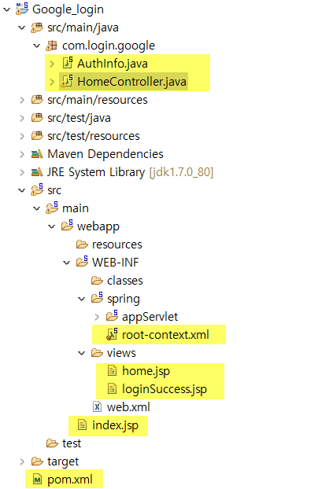
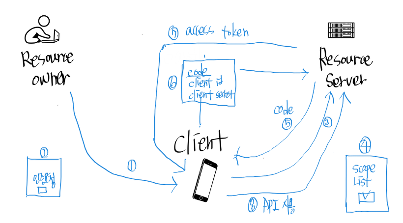

# google_login
구글 login API , OAUTH 2.0으로 인증

-------------

  
  
# pom.xml 추가한 내용 
```java 
 <!-- Google Login -->
        <dependency>
            <groupId>org.springframework.social</groupId>
            <artifactId>spring-social-google</artifactId>
            <version>1.0.0.RELEASE</version>
        </dependency>
 
 
    	<dependency>
            <groupId>org.apache.httpcomponents</groupId>
            <artifactId>httpclient</artifactId>
            <version>4.5.3</version>
        </dependency>
        
        <!-- https://mvnrepository.com/artifact/com.fasterxml.jackson.core/jackson-core -->
		<dependency>
		    <groupId>com.fasterxml.jackson.core</groupId>
		    <artifactId>jackson-core</artifactId>
		    <version>2.9.8</version>
		</dependency>
``` 

# 구글 APIS 홈페이지에 적어놓은 URL
- 승인된 자바스크립트 원본
http://localhost:8080	
- 승인된 리디렉션 URI
http://localhost:8080/google/googlecallback	


-------------


# 구글 API OAUTH 2.0 설명
  

### 용어 설명
- Resource owner = 우리 고객(유저)
- client = 우리 서버 (모두의 주방)
- Resource server = 고객의 정보를 가지고 있는 서버 (google)
- scope => 전체 서비스 중 1개 (구글 캘린더 중 캘린더 list 서비스) 
- client id, client secret => 구글 디벨렆 홈페이지에서 사전에 발급받은 것 


### 순서 설명
1. 고객이 모두의 주방에 구글로 로그인버튼 클릭
2. 우리는 고객에게 인증요청이 필요하다고 알림
3. 고객이 동의 버튼 누르면 구글에게 요청
4. 구글은 고객에게 scope List를 보여주며 이러한 서비스 제공하는 데 동의? 하는지 물어봄 (최초 1번)
5. 고객이 동의를 하면 구글이 모두의 주방에게 code(인증 코드)를 준다.  
  -> 이 code로 직업 api 사용할 수 없으며 access token과 교환해야 api 사용 가능
6. 모두의 주방은 code와 client id, client secret 을 post 방식으로 구글에게 전송한다
7. 구글에서 access token을 준다. (code와 client id, client secret와 교환하는 격)
8. access token을 이용하여 API를 사용 한다.


-------------


# MappingJackson2HttpMessageConverter 에러 나면  
https://bumcrush.tistory.com/150

# 참고 블로그  
https://gdtbgl93.tistory.com/73  
